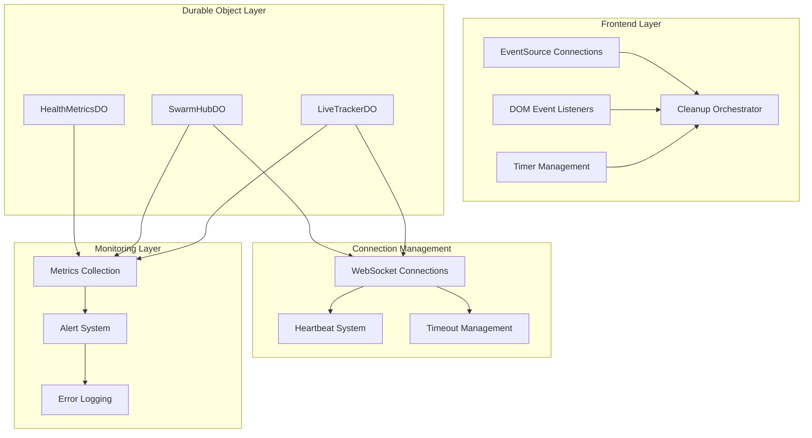

# Design Document: Performance Optimization Phase 2

## Overview

This design addresses the remaining high-priority performance issues and memory leaks identified in the comprehensive audit. Building on Phase 1 fixes, this phase focuses on completing the cleanup of EventSource listeners, implementing robust connection management, fixing remaining timer leaks, and optimizing resource usage patterns.

The design emphasizes defensive programming, proper resource lifecycle management, and comprehensive monitoring to achieve full production readiness.

## Architecture

### High-Level Architecture



### Component Interaction Flow

1. **Frontend Cleanup**: Centralized cleanup orchestrator manages all EventSource, DOM, and timer resources
2. **Connection Management**: WebSocket connections have proper timeouts, heartbeats, and graceful cleanup
3. **Resource Optimization**: Bounded data structures, efficient algorithms, and proper lifecycle management
4. **Monitoring Integration**: Comprehensive metrics collection with proactive alerting

## Components and Interfaces

### 1. EventSource Listener Management System

**Purpose**: Centralized management of EventSource listeners to prevent memory leaks

**Interface**:
```typescript
interface EventSourceManager {
  createEventSource(url: string): ManagedEventSource;
  addListener(es: ManagedEventSource, type: string, listener: EventListener): void;
  removeAllListeners(es: ManagedEventSource): void;
  cleanup(): void;
}

interface ManagedEventSource extends EventSource {
  listeners: Array<{ type: string; listener: EventListener }>;
  safeClose(): void;
}
```

**Implementation Strategy**:
- Wrap native EventSource with tracking capabilities
- Maintain listener registry for each EventSource instance
- Implement safe cleanup that removes listeners before closing
- Add to existing files: `liveGameStream.js`, `prematchStream.js`

### 2. Timer Management System

**Purpose**: Centralized timer lifecycle management to prevent leaks

**Interface**:
```typescript
interface TimerManager {
  createInterval(callback: Function, delay: number): TimerHandle;
  createTimeout(callback: Function, delay: number): TimerHandle;
  clearTimer(handle: TimerHandle): void;
  clearAllTimers(): void;
}

interface TimerHandle {
  id: number;
  type: 'interval' | 'timeout';
  cleanup(): void;
}
```

**Implementation Strategy**:
- Replace direct `setInterval`/`setTimeout` calls with managed versions
- Track all active timers in WeakMap or central registry
- Implement cleanup on all error paths and mode changes
- Use AbortController pattern for complex timeout scenarios

### 3. WebSocket Connection Manager

**Purpose**: Robust WebSocket connection handling with timeouts and cleanup

**Interface**:
```typescript
interface WebSocketManager {
  connect(url: string, timeout?: number): Promise<ManagedWebSocket>;
  disconnect(ws: ManagedWebSocket): Promise<void>;
  setHeartbeat(ws: ManagedWebSocket, interval: number): void;
}

interface ManagedWebSocket extends WebSocket {
  connectionTimeout: number;
  heartbeatInterval?: number;
  lastHeartbeat?: number;
  safeClose(): Promise<void>;
}
```

**Implementation Strategy**:
- Wrap WebSocket creation with timeout logic
- Implement exponential backoff for reconnections
- Add heartbeat-based connection health monitoring
- Ensure cleanup on all error conditions

### 4. HealthMetricsDO Optimization

**Purpose**: Bounded memory usage for health metrics collection

**Interface**:
```typescript
interface OptimizedHealthMetrics {
  buckets: CircularBuffer<MetricBucket>;
  leases: BoundedMap<string, Lease>;
  addMetric(metric: Metric): void;
  pruneOldData(): void;
}

interface CircularBuffer<T> {
  capacity: number;
  size: number;
  add(item: T): void;
  getAll(): T[];
  clear(): void;
}

interface BoundedMap<K, V> {
  maxSize: number;
  set(key: K, value: V): void;
  get(key: K): V | undefined;
  prune(): void;
}
```

**Implementation Strategy**:
- Replace array filter operations with circular buffer
- Implement LRU eviction for leases map
- Add aggressive pruning with configurable limits
- Use fixed-size data structures to prevent unbounded growth

### 5. Heartbeat-Based Client Detection

**Purpose**: Automatic detection and cleanup of dead clients

**Interface**:
```typescript
interface HeartbeatManager {
  startHeartbeat(clientId: string, timeout: number): void;
  recordHeartbeatResponse(clientId: string): void;
  checkDeadClients(): string[];
  cleanupDeadClient(clientId: string): void;
}

interface ClientHeartbeat {
  clientId: string;
  lastSeen: number;
  timeout: number;
  isAlive: boolean;
}
```

**Implementation Strategy**:
- Track heartbeat responses from clients
- Implement timeout-based dead client detection
- Clean up all resources associated with dead clients
- Add configurable timeout periods (30s default)

## Data Models

### EventSource Listener Registry
```typescript
interface ListenerRegistry {
  eventSources: Map<EventSource, ListenerEntry[]>;
  cleanup(): void;
}

interface ListenerEntry {
  type: string;
  listener: EventListener;
  addedAt: number;
}
```

### Timer Registry
```typescript
interface TimerRegistry {
  activeTimers: Map<number, TimerEntry>;
  cleanup(): void;
}

interface TimerEntry {
  id: number;
  type: 'interval' | 'timeout';
  createdAt: number;
  callback: Function;
}
```

### Connection Health Metrics
```typescript
interface ConnectionMetrics {
  totalConnections: number;
  activeConnections: number;
  failedConnections: number;
  averageResponseTime: number;
  lastUpdated: number;
}
```

### Resource Usage Tracking
```typescript
interface ResourceUsage {
  memoryUsage: number;
  clientCount: number;
  cacheSize: number;
  subscriptionCount: number;
  connectionCount: number;
}
```

## Correctness Properties

*A property is a characteristic or behavior that should hold true across all valid executions of a system-essentially, a formal statement about what the system should do. Properties serve as the bridge between human-readable specifications and machine-verifiable correctness guarantees.*

### Property 1: EventSource Listener Cleanup Completeness
*For any* EventSource instance, when it is closed, all previously added event listeners should be removed before the close operation, and reconnections should not accumulate duplicate listeners
**Validates: Requirements 1.1, 1.2, 1.3, 1.5**

### Property 2: Timer Lifecycle Management
*For any* timer (interval or timeout) created through the system, it should be properly tracked and cleanable on all code paths including error conditions
**Validates: Requirements 2.1, 2.2, 2.3, 2.4, 2.5**

### Property 3: WebSocket Connection Timeout Enforcement
*For any* WebSocket connection attempt, if the connection does not establish within 30 seconds, the connection attempt should be aborted and resources cleaned up with exponential backoff for retries
**Validates: Requirements 3.1, 3.2, 3.3, 3.4, 3.5**

### Property 4: HealthMetrics Bounded Growth
*For any* sequence of operations on HealthMetricsDO, the memory usage should remain bounded by configured limits (10,000 leases, circular buffer for buckets) regardless of operation duration
**Validates: Requirements 4.1, 4.2, 4.3, 4.4, 4.5**

### Property 5: Resource Limit Enforcement
*For any* resource allocation (games, connections, retries), the system should enforce configured maximum limits (1000 games, 3 retries) and implement appropriate backoff strategies
**Validates: Requirements 5.2, 5.3, 5.4, 5.5**

### Property 6: Heartbeat-Based Client Management
*For any* client connection, if no heartbeat response is received within 30 seconds, the client should be marked as dead and all associated resources should be cleaned up
**Validates: Requirements 6.1, 6.2, 6.3, 6.4, 6.5**

### Property 7: DOM Event Listener Management
*For any* DOM element, adding event listeners should not result in duplicates, and old listeners should be removed before adding new ones
**Validates: Requirements 7.1, 7.2, 7.3, 7.4, 7.5**

### Property 8: Monitoring and Alerting Thresholds
*For any* monitored metric (memory usage, client count, connection failures), when the metric exceeds its configured threshold, an alert should be generated within the specified time window
**Validates: Requirements 8.1, 8.2, 8.3, 8.4, 8.5**

### Property 9: Error Handling Graceful Degradation
*For any* error condition during cleanup operations (WebSocket close, EventSource close, timer cleanup, client cleanup), the system should continue with remaining cleanup tasks and log errors appropriately
**Validates: Requirements 9.1, 9.2, 9.3, 9.4, 9.5**

### Property 10: Performance Optimization Implementation
*For any* performance-critical operation, the system should use optimized approaches (Web Workers for large JSON, requestAnimationFrame for DOM updates, Map for lookups, batching for UI updates)
**Validates: Requirements 10.1, 10.2, 10.3, 10.4, 10.5**

## Error Handling

### Connection Error Handling
- **WebSocket Connection Failures**: Implement exponential backoff with jitter
- **EventSource Connection Failures**: Clean up listeners before retry attempts
- **Heartbeat Failures**: Graceful client removal without affecting other clients

### Resource Cleanup Error Handling
- **Timer Cleanup Failures**: Log errors but continue with other cleanup operations
- **Listener Removal Failures**: Attempt alternative cleanup methods
- **Memory Cleanup Failures**: Implement fallback cleanup strategies

### Monitoring Error Handling
- **Metric Collection Failures**: Use circuit breaker pattern to prevent cascade failures
- **Alert System Failures**: Implement backup alerting mechanisms
- **Log System Failures**: Use local storage as fallback

## Testing Strategy

### Unit Testing Approach
- **EventSource Management**: Test listener tracking, cleanup, and error conditions
- **Timer Management**: Test timer creation, cleanup, and leak prevention
- **WebSocket Management**: Test connection timeouts, cleanup, and error handling
- **HealthMetrics**: Test bounded growth, pruning, and memory limits
- **Heartbeat System**: Test dead client detection and cleanup

### Property-Based Testing Configuration
- **Library**: Use fast-check for JavaScript/TypeScript property-based testing
- **Test Iterations**: Minimum 100 iterations per property test
- **Test Environment**: Run in both browser and Node.js environments
- **Coverage**: Each correctness property implemented as separate test

### Integration Testing
- **End-to-End Cleanup**: Test complete cleanup on page navigation
- **Resource Limit Testing**: Test behavior at configured limits
- **Error Recovery Testing**: Test graceful degradation under various failure modes
- **Performance Testing**: Test efficiency improvements under load

### Load Testing Requirements
- **Connection Churn**: Test rapid connect/disconnect cycles
- **Memory Pressure**: Test behavior under high memory usage
- **Timer Stress**: Test with hundreds of concurrent timers
- **EventSource Stress**: Test with multiple concurrent EventSource connections

The testing strategy ensures comprehensive validation of all performance improvements and memory leak fixes, providing confidence in production deployment.